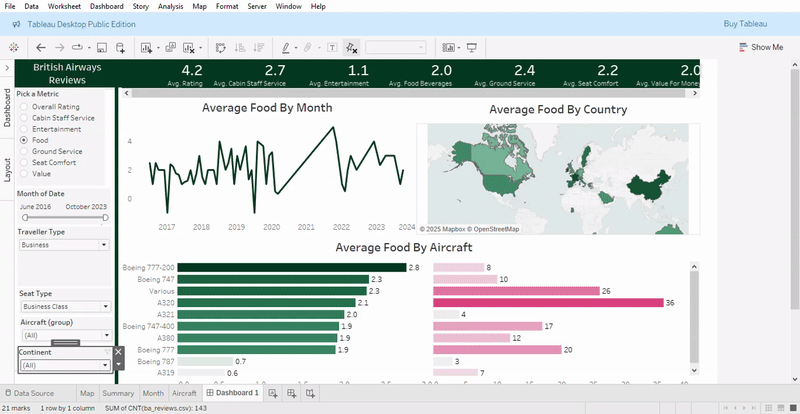

# British Airways Reviews Dashboard – Tableau Project
## Overview
This dashboard analyzes user-submitted reviews of British Airways flights from 2016 to 2023. It offers a comprehensive view of customer satisfaction based on various service areas, such as:

- Cabin Staff Service
- Entertainment
- Food & Beverages
- Ground Service
- Seat Comfort
- Value for Money

---

## Demo

[View the Interactive Dashboard on Tableau.](https://public.tableau.com/app/profile/rosemary.ojwang/viz/BritishAirwaysReviews_17459001753520/Dashboard1)

---

## Key Features
Filterable by:

- Rating metric
- Date range
- Traveller Type (e.g. Solo Leisure)
- Seat Type
- Aircraft Type
- Continent

---

## Interactive Visuals:

- Time Series: Average seat comfort by month
- Geographic Heatmap: Country-level comfort ratings
- Aircraft Comparison: Comfort ratings by plane type + volume of reviews

---

## Insights Displayed:

- Aggregated average ratings for 7 service categories
- Visual breakdown of rating trends and aircraft-specific performance

---

## Tools Used
- Tableau Desktop for dashboard creation
- Map for geospatial visualization
- Airline review datasets

---

## Insights
Varying experiences across regions and aircraft models—key for service improvement.

---

## Purpose
To practice advanced Tableau dashboard features such as:

- Dynamic parameter switching
- Custom filters
- Integration of maps and bar charts
- UX-conscious layout design

---

[def]: TableauPublic-Book12025-04-2906-53-48-ezgif.com-video-to-gif-converter.gif